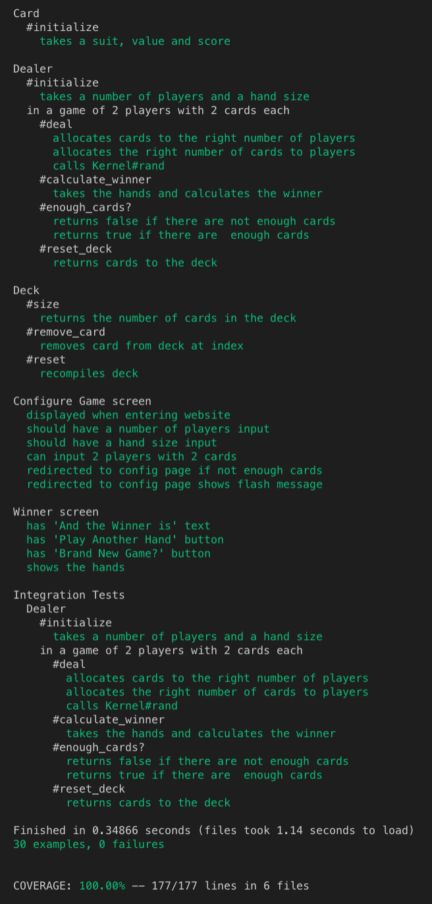
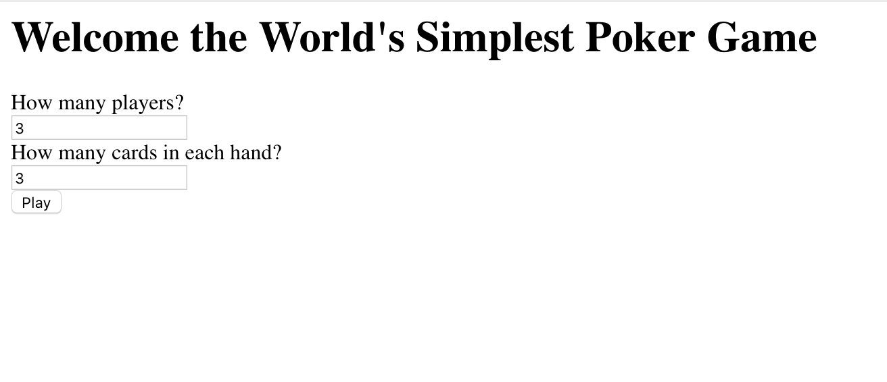
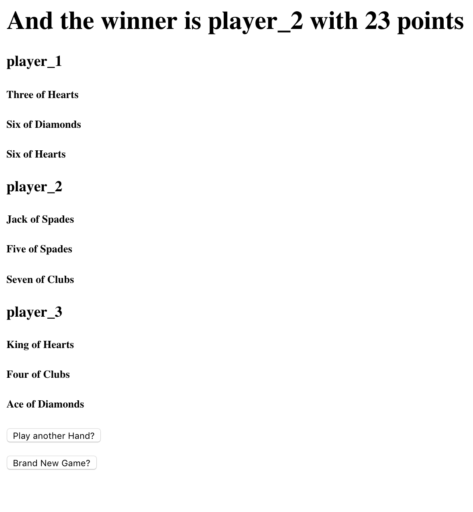

[](https://travis-ci.com/JonathanAndrews/worlds_simplest_poker)

# World's most simple Poker

```
As a User,
So I can configure the game,
I want to input the number of players and hand size.

As a User,
So I can see who won,
I want to be able to see each player's the hand.

As a User,
So I can see if it was draw,
I want to be told if it was a draw or not.

As a User,
So I can play another hand,
I want there to be a play another hand button.

```
## My Approach

I BDD'ed this project.

`User Story --> Feature Test --> Unit Test --> Red --> Green --> Refactor --> Repeat`

## Tech

Built with

* Language      : Ruby
* Testing       : RSpec (Unit and Feature)
* CI            : Travis CI
* Linter        : RuboCop
* Code Coverage : SimpleCov 

## Usage

1. Clone this repo to your local machine.
```
git clone https://github.com/JonathanAndrews/worlds_simplest_poker
```
2. `cd` into the project.
2. `bundle install` to install all the dependencies.
2. `rspec` to run the tests.
2. The tests should look like this.



6. To run the program locally `rackup`
7. Then go to `http://localhost:9292`
8. Alternatively, you could just go to 
`https://worlds-simplest-poker.herokuapp.com/` 

## Screen Shots
You can change the number of players and the number of cards dealt.



The result is automatically calculated on the next page.



## Contributing

Make a pull request if you want to contribute. :)
